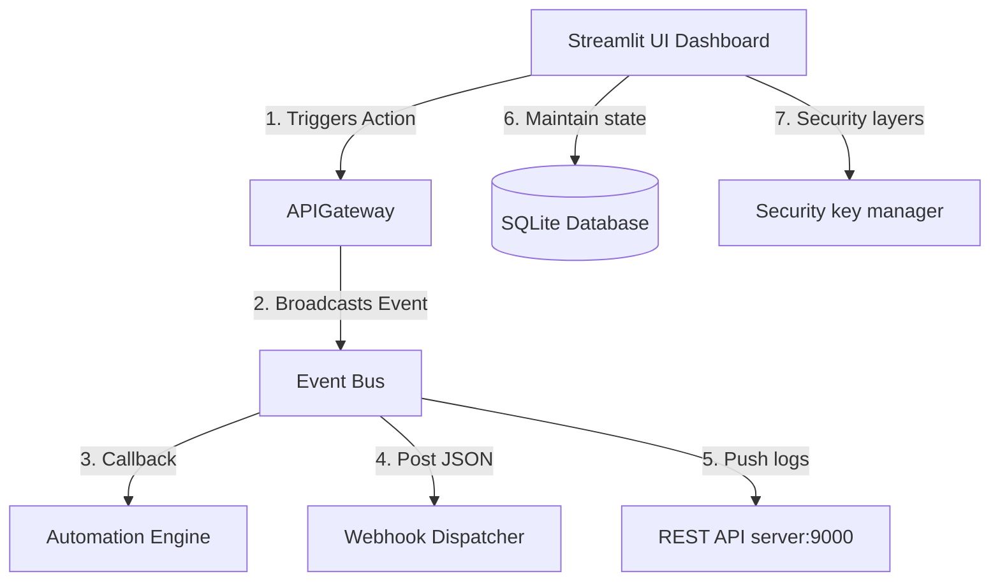

# 🎬 Nova Studio AI

[](https://www.python.org/)
[](LICENSE)
[](https://streamlit.io/)
[](.github/workflows/test.yml)
[](.github/workflows/security.yml)

Nova Studio AI is a production-grade, local, and offline non-linear video creation workspace. It orchestrates a modular pipeline of AI Agents (Script, Voice, Storyboard, Timeline Compiler) to convert raw ideas into complete editable video exports.

---

## 📖 Table of Contents
1. [Problem Statement](#-problem-statement)
2. [Key Features](#-key-features)
3. [System Architecture](#-system-architecture)
4. [Folder Directory Layout](#-folder-directory-layout)
5. [Getting Started & Installation](#-getting-started--installation)
6. [REST API Documentation](#-rest-api-documentation)
7. [Plugin SDK Guidelines](#-plugin-sdk-guidelines)
8. [Frequently Asked Questions (FAQ)](#-frequently-asked-questions-faq)
9. [Roadmap](#-roadmap)
10. [Contributing & License](#-contributing--license)

---

## 💡 Problem Statement

Creating engaging short-form video content using AI models typically involves bouncing between multiple disjointed cloud services: LLM script generators, TTS speech synthesizers, image generation interfaces, and traditional NLE timeline editors. This workflow suffers from:
* **High Latency & Costs**: Relying on expensive cloud APIs.
* **Privacy Risks**: Storing drafts and inputs on remote servers.
* **Disjointed Automation**: No smooth path from text script to synced subtitle audio tracks and clips timelines.

**Nova Studio AI** solves this by packaging the entire pipeline locally, routing calculations offline to local models (Ollama, Kokoro TTS, ComfyUI) inside an integrated non-linear timeline workspace.

---

## 🌟 Key Features

* **Decoupled Event Bus**: Modules publish state changes to a thread-safe broker, enabling custom plugin extensions without touching core logic.
* **Non-Linear Editor (NLE)**: Interactive lanes supporting splits, duplicate clones, ripple deletes, and version history rollback snapshots.
* **Vocal Synthesis & Lip Sync**: Kokoro TTS engine generating viseme mouth shape mappings and subtitle karaoke grids.
* **Database & Cache Auto-optimizer**: Reclaim unused SQLite space and scan asset file sizes automatically.
* **REST API Gateway**: Background daemon HTTP server listening on port 9000 with webhook dispatcher queues.

---

## ⚙️ System Architecture

The studio leverages a fully event-driven architecture to communicate across layers:



---

## 📂 Folder Directory Layout

```text
nova-studio/
├── core/
│   ├── api/            # EventBus, APIGateway, RESTServer, TaskQueue, Webhooks
│   ├── comfy/          # ComfyUI Connectors & Workflow Managers
│   ├── timeline/       # NLE Timeline cuts, snapshots versions
│   ├── generation/     # Structured prompts, characters consistency profile
│   ├── audio/          # Subtitle karaoke compilers, sidechain ducking, TTS
│   ├── database/       # SQLite storage indexing & tables
│   ├── logger/         # Rotating action logger
│   └── plugins/        # swappable provider script loaders
├── plugins/            # folder-based SDK plugins (e.g. sample_plugin)
├── tests/              # unit test suites
├── app.py              # Streamlit dashboard
├── requirements.txt    # dependencies list
└── README.md           # user guide
```

---

## 🚀 Getting Started & Installation

### Prerequisites
* **Python 3.10 or 3.11** installed.
* **FFmpeg** installed and added to your system environment variables.

### 1. Installation
Clone the repository and install requirements inside a virtual environment:
```bash
git clone https://github.com/<your-username>/nova-studio-ai.git
cd nova-studio-ai

# Set up virtual environment
python -m venv venv
source venv/bin/activate  # Or venv\Scripts\activate on Windows

# Install dependencies
pip install -r requirements.txt
```

### 2. Run the Dashboard
Start the application server using:
```bash
streamlit run app.py
```
Open **`http://localhost:8501`** in your browser.

---

## 🌐 REST API Documentation

The background daemon HTTP server runs on `http://127.0.0.1:9000/api`.

### Endpoints Details

| Method | Endpoint | Description | Example Response |
| ------ | -------- | ----------- | ---------------- |
| `GET`  | `/api/system` | Queries OS, GPU, and disk statistics. | `{"gpu_name": "NVIDIA RTX 4080", ...}` |
| `GET`  | `/api/projects` | Lists all project metadata logs. | `[{"id": "proj_123", "name": "Untitled"}]` |
| `GET`  | `/api/history` | Fetches Event Bus dispatched history logs. | `[{"id": "evt_abc", "type": "Project Saved"}]` |

---

## 🔌 Plugin SDK Guidelines

Developers can register folder-based plugins under `plugins/<name>/`.

### Required Files
* `plugin.json`: Metadata, categories, and requested sandbox permissions.
* `main.py`: SDK subclass implementation.

### Example `plugin.json`
```json
{
    "id": "sample_plugin",
    "name": "Sample Transitions",
    "version": "1.0.0",
    "category": "exporter",
    "permissions": {
        "filesystem": true,
        "network": false
    }
}
```

---

## ❓ Frequently Asked Questions (FAQ)

<details>
<summary><b>1. Why is ComfyUI status marked offline?</b></summary>
ComfyUI server must be running locally on port 8188. If offline, the studio samplers run in mock simulation fallback.
</details>

<details>
<summary><b>2. How can I optimize the database size?</b></summary>
Go to the <code>System Diagnostics</code> tab in the UI sidebar and click <code>Re-Optimize SQLite database</code> to run VACUUM.
</details>

---

## 🗺️ Roadmap

- [ ] **AI Voice Cloning**: Integrate local model checkpoints cloning audio inputs.
- [ ] **AI Lip Sync**: Generate mouth-shape transformations matched to dialogue wavs.
- [ ] **Distributed Rendering**: Coordinate multiple rendering nodes across networks.

---

## 🤝 Contributing & License

For guidelines, please check [CONTRIBUTING.md](CONTRIBUTING.md).

This project is licensed under the [MIT License](LICENSE).
